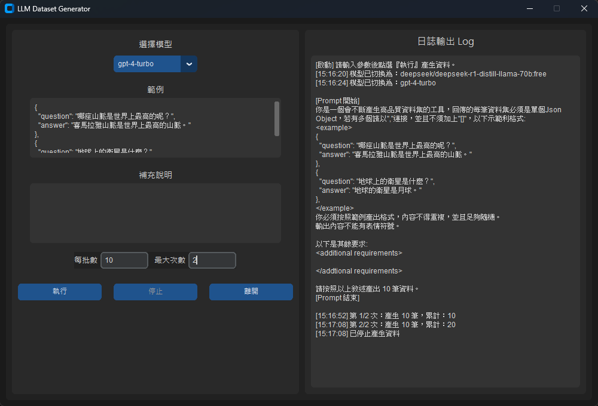

# LLM Dataset Generator



## 1. Introduction

這是一個專門為大型語言模型（LLM）自動產生訓練資料集的小型 GUI 工具，  
可透過自訂 Prompt 與指定參數，自動持續生成 JSON 格式的訓練資料，  
由 **大安金城武** 製作。

## 2. Quick Start

### Python 環境建議

- Python 3.11
- 建議使用 Conda 管理虛擬環境

### 建立 Conda 環境

```bash
conda env create -f environment.yml

conda activate llm-dataset-generator
```

### 設定 API Key

創建.env檔案
```
# 建立 .env 檔案（Windows）
copy .env.example .env

# 建立 .env 檔案（Linux / macOS）
cp .env.example .env

```
設定api key
```
OPENAI_API_KEY=your-api-key
```


### 啟動介面

```bash
python interface.py
```

## 3. 使用說明

- 採用gpt-4-turbo模型，若要使用其他的請到configuration.py更改
- 輸入資料集範例、補充說明、批次產生數量
- 點選「執行」可連續產生資料，直到按下「停止」
- 每筆資料會即時寫入 `outputs/` 目錄
- 右側日誌視窗會顯示執行狀態與錯誤資訊

## 4.資料處理(必看)

最後生成出的datasets為txt，請自行轉換成Json檔案(把最後的,拿掉，包入[]變成Json Array)


<br>

## 5. 專案結構

```
├── interface.py             # GUI 控制邏輯
├── main.py                  # 資料生成邏輯
├── configuration.py         # 載入 API Key 與模型設定
├── utils.py                 # 模板處理工具
├── prompts/
│   └── mainprompt.txt       # Prompt 樣板（含佔位符）
├── outputs/                 # 輸出資料儲存位置
├── environment.yml          # Conda 環境配置
├── .env.example             # API Key 範例檔
├── .gitignore               # Git 忽略清單
└── README.md                # 專案說明
```

## 6. 使用套件

- langchain
- langchain-community
- openai
- langchain-openai
- customtkinter
- python-dotenv

## 7. 常見錯誤

| 錯誤訊息                       | 原因                          | 解決方式                                                                   |
| -------------------------- | --------------------------- | ---------------------------------------------------------------------- |
| `model_not_found`          | 找不到模型，或無權限使用 GPT-4          | 確認你已開通 GPT-4 Turbo，或改用 `gpt-3.5-turbo` 測試                              |
| `invalid_api_key`          | API 金鑰錯誤或無效                 | 檢查 `.env` 中 `OPENAI_API_KEY` 是否正確、沒有空格或錯字                              |
| `insufficient_quota`       | 免費額度用完或尚未儲值                 | 前往 [OpenAI 金流設定](https://platform.openai.com/account/billing) 儲值至少 \$5 |
| `Too Many Requests`        | 請求過快                        | 等待幾秒後再試，避免連續快速點擊「執行」按鈕                                                 |
| `insufficient_permissions` | API 金鑰缺少 `model.request` 權限 | 使用個人 API 金鑰（以 `sk-` 開頭），並確認有正確角色（如 Owner）及權限                           |
| `network_error` / 連線失敗     | 無網路、被防火牆或校園封鎖               | 確保可正常開啟 [OpenAI 平台](https://platform.openai.com)                       |
| 程式卡住／視窗未回應                 | 請求尚未完成或資料太大                 | 等待幾秒；若長時間無反應請點擊「停止」再重新執行                                               |

## 8. License

本專案採用 **Apache License 2.0** 授權。  
您可以自由下載、使用、修改本工具，但須在衍生作品中保留原始作者資訊，  
且不得移除本授權條款及著作權聲明。若您擁有相關專利，也請遵守 Apache 2.0 的專利授權規範。

詳情請見 [LICENSE](LICENSE) 檔案。

---

## 9. 聯絡作者

如果您在使用過程中遇到問題或有建議，歡迎透過 GitHub Issue 或 email 聯絡我。  
非常歡迎 star ⭐️ 本專案，也歡迎 fork 與貢獻功能！

> Made with ❤️ by 大安金城武
